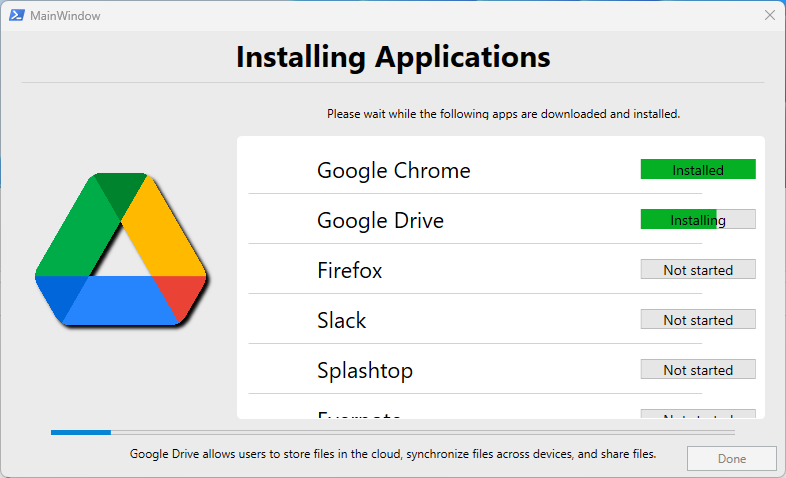

# Windows Combo Installer 

## Installs the following software with a GUI interface to display progress
- Google Chrome
- Google Drive
- Firefox
- Slack
- Splashtop
- Evernote
- Crowdstrike Falcon
- Nextiva
 
## How it works
The script checks if relevant software is installed and if so what version. If the software is not installed or it is detected to be out of date the latest version is downloaded from publicly available URL and installed. The authenticode signature is also compared to ensure the package is signed by the correct team for added security. 

Crowdstrike Falcon and Nextiva are not publicly available to download so a local installer is included and will need to be manually updated as needed. 

